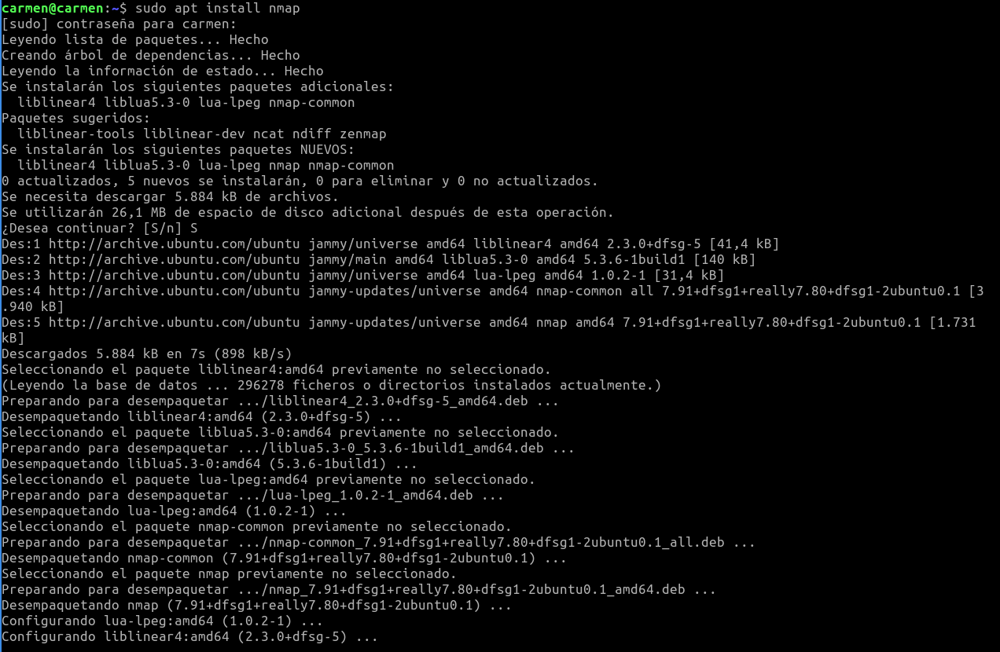
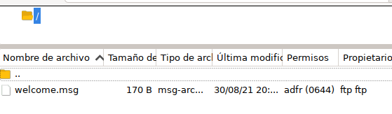
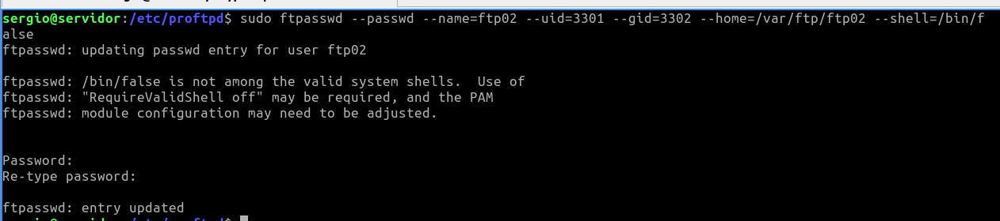
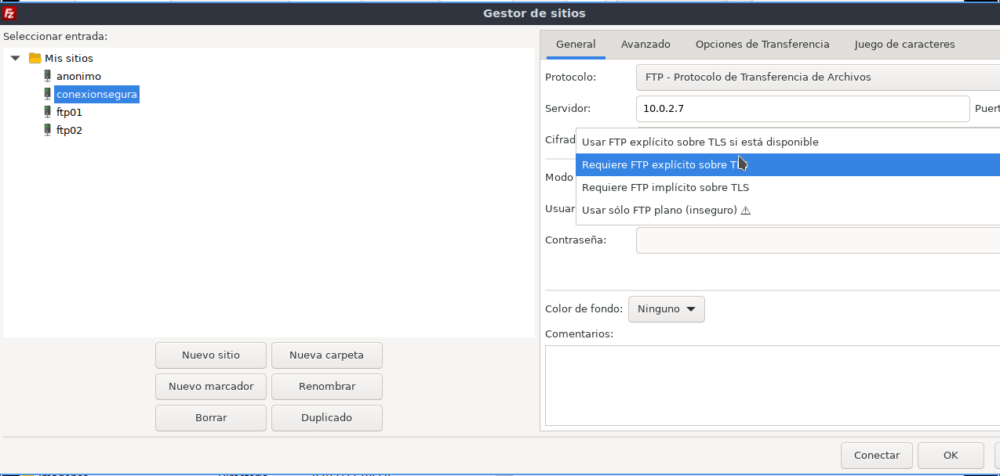

# Servicio de transferencia de ficheros
## Infraestructura
Reutilizaremos las MV de la práctica de **ssh**. Dos MV dentro de una **red NAT**:

* **Servidor**: con un Ubuntu server sin entorno gráfico.
    * Usuario: **sergio**, contraseña: **sergio**.
* **Casa**: con un Lubuntu con el entorno gráfico por defecto (LXQt).
    * Usuario: **carmen**, contraseña: **carmen**.

Desde el equipo **Casa** nos conectaremos al equipo **Servidor** mediante una conexión **ssh** autentificándonos mediante claves asimétricas **ed25519**.


## Instalación y uso básico

1. Acceder al servidor:
```bash
ssh -i ~/.ssh/id_ed25519 10.0.2.4
```


2. Instalar proftpd:
```bash
sudo apt update
sudo apt install proftpd
```


3. Realizar algunos cambios en el archivo de configuración:
```bash
sudo nano /etc/proftpd/proftpd.conf
```


* Cambiar el nombre del servidor.


* Desactivar el protocolo IP versión 6.


* No mostrar el mensaje de bienvenida hasta que el usuario no se haya autentificado correctamente.


> Puedes obtener más información sobre las distintas directivas de configuración en:
http://www.proftpd.org/docs/directives/configuration_full.html. Revisa las directivas:
**DeferWelcome**, **DisplayConnect**, **DisplayLogin**, **DisplayChdir**, **DisplayGoAway**,
**DisplayQuit**, **AccessGrantMsg** y **AccessDenyMsg**.

4. Comprobar estado del servicio **proftpd**:
```bash
sudo systemctl status proftpd
```


5. Con los siguientes comandos lo activaremos para que se inicie al arrancar el servidor y lo iniciaremos:
```bash
sudo systemctl enable proftpd
sudo systemctl start proftpd
```


> Otras comandos del servicio son:
>```bash
>sudo systemctl enable proftpd
>sudo systemctl start proftpd
>sudo systemctl stop proftpd
>sudo systemctl restart proftpd
>sudo systemctl status proftpd
>sudo systemctl reload proftpd
>sudo systemctl show proftpd
>```

6. Reglas firewall:
```bash
sudo ufw enable
sudo ufw allow 20/tcp
sudo ufw allow 21/tcp
sudo ufw status
```


7. Probar desde el cliente qué puertos tiene abiertos el servidor, en nuestro ejemplo desde el equipo **Casa** ejecutaremos:
```bash
nmap 10.0.2.4 -p 1-1024
```



Si no tienes instalada esta utilidad, instalalá con: **sudo apt install nmap**. Esta comprobación
también se puede hacer desde el propio servidor, pero es menos fiable que desde otro equipo ya que
puede conectarse por localhost.

8. Conexión FTP desde el cliente, en nuestro ejemplo el equipo **Casa**. (-A: forzar modo activo):
```bash
ftp -A 10.0.2.4
```


>Para evitar problemas con el firewall en todo momento utilizaremos el modo de transferencia 'activo'. Este modo utiliza unicamente los puertos 20 y 21 del servidor.

9. Comprobar en el equipo **Servidor** qué conexiones están establecidas con otros equipos:
```bash
ss | grep tcp
```


10. Instalar el cliente gráfico **Filezilla** en el equipo **Casa**. Crea una nueva conexión en el **Gestor de sitios**. Conectarse al equipo **Servidor** con el protocolo FTP y cifrado FTP plano. Recuerda conectar el modo **activo** en la pestaña **Opciones de transferencia** del Gestor de sitios.


## Configurar una cuenta anónima
1. Volvemos a realizar algunos cambios en el archivo de configuración:
```bash
sudo nano /etc/proftpd/proftpd.conf
```


Descomentamos todo el bloque <Anonymous ~ftp> de modo que quede de la siguiente forma:

```bash
<Anonymous ~ftp>
User ftp
Group nogroup
# We want clients to be able to login with "anonymous" as well as
"ftp"
UserAlias anonymous ftp
# Cosmetic changes, all files belongs to ftp user
DirFakeUser on ftp
DirFakeGroup on ftp
RequireValidShell off
# Limit the maximum number of anonymous logins
MaxClients 10
# We want 'welcome.msg' displayed at login, and '.message' displayed
# in each newly chdired directory.
DisplayLogin welcome.msg
DisplayChdir .message
# Limit WRITE everywhere in the anonymous chroot
<Directory *>
<Limit WRITE>
DenyAll
</Limit>
</Directory>
# Uncomment this if you're brave.
# <Directory incoming>
# # Umask 022 is a good standard umask to prevent new files and>
# # (second parm) from being group and world writable.
# Umask022 022
# <Limit READ WRITE>
# DenyAll
# </Limit>
# <Limit STOR>
# AllowAll
# </Limit>
# </Directory>
</Anonymous>
```


2. Reiniciaremos el servicio **proftpd**:
```bash
sudo systemctl restart proftpd
```


3. Puedes probar que los archivos de configuración son correctos con el siguiente comando:
```bash
sudo /usr/sbin/proftpd --configtest -c /etc/proftpd/proftpd.conf
```


4. Prueba que puedes acceder al servidor sin escribir contraseñas usando los dos usuarios anónimos:
anonymous y ftp. Realiza la prueba tanto desde el teminal como desde la aplicación gráfica filezilla.
>Realmente al instalar ProFTP se crea el usuario **ftp**, anonymous es un alias de este usuario.
Puedes verlo en la directiva **UserAlias** del bloque **<Anonymous >** del archivo de
configuración. Además puedes ver que este usuario existen en el sistema en el archivo de
usuarios: **sudo cat /etc/passwd**.




5. Si queremos que el usuario anónimo tenga una carpeta diferente, tenemos que crear dicha carpeta, por ejemplo:
```bash
sudo mkdir -p /var/ftp/anonimo
sudo chown ftp.nogroup /var/ftp/anonimo
```


E indicarlo en el fichero de configuración, cambiando la etiqueta **<Anonymous ~ftp>** por
**<Anonymous /nombre-de-carpeta>**. Por ejemplo: **<Anonymous /var/ftp/anonimo>**


6. Para saber que estamos en esta nueva carpeta, le vamos a crear un fichero dentro:
```bash
sudo touch /var/ftp/anonimo/UsuarioAnonimo.txt
```
> Otra opción sería crear/modificar el archivo **welcome.msg** que nos indica la directiva
**DisplayLogin**.


7. Recuerda reinicia el servicio **proftpd**:
```bash
sudo systemctl restart proftpd
```


8. Puedes probar que los archivos de configuración son correctos con el siguiente comando:
```bash
sudo /usr/sbin/proftpd --configtest -c /etc/proftpd/proftpd.conf
```


9. Vuelve a probar a acceder al servidor usando los usuarios: anonymous y ftp. Tanto desde el teminal como desde la aplicación gráfica filezilla. Esta vez debe aparecer el nuevo directorio de trabajo.


## Configuración de usuarios virtuales
Los usuarios virtuales son aquellos que no son usuarios de sistema pero si tienen acceso a algunos recursos
a través del servicio FTP. Los crearemos usando el **comando ftpasswd**. Los usuarios y las contraseñas se
almacenan en un fichero que vamos a crear en **/etc/proftpd/ftpd.passwd**:

1. Primero vamos a crear las carpetas de trabajo que le vamos a asignar a cada usuario virtual:
```bash
sudo mkdir /var/ftp/ftp01
sudo mkdir /var/ftp/ftp02
sudo chown ftp.nogroup /var/ftp/ftp01 /var/ftp/ftp02
```


2. Ahora nos situamos en el directorio de configuración de proftpd y crearmos un archivo vacío para generar los usuarios virtuales.
```bash
cd /etc/proftpd/
sudo touch ftpd.passwd
```


3. Después creamos los usuarios virtuales ejecutando el comando ftpasswd:
```bash
sudo ftpasswd --passwd --name=ftp01 --uid=3001 --gid=3001 --
home=/var/ftp/ftp01 --shell=/bin/false
$ sudo ftpasswd --passwd --name=ftp02 --uid=3002 --gid=3002 --
home=/var/ftp/ftp02 --shell=/bin/false
```
Nos pedirá que introduzcamos la contraseña de los usuarios virtuales.




4. Para saber que estamos en nuestra carpeta, le vamos a crear un fichero dentro de cada una:
```bash
sudo touch /var/ftp/ftp01/soyusuario1.txt
sudo touch /var/ftp/ftp02/soyusuario2.txt
```


> Otra opción sería crear en dicha carpeta un archivo **.message** tal como se indica en la
directiva **DisplayChdir** del archivo de configuración.

5. A continuación necesimos modificar el archivo de configuración:
```bash
sudo nano /etc/proftpd/proftpd.conf
``` 

Descomentamos las líneas:
```bash
DefaultRoot ~
RequireValidShell off
```


Y al final del archivo incluimos la siguiente directiva:
```bash
AuthUserFile /etc/proftpd/ftpd.passwd
```

6. Guardamos y reiniciamos el servicio **proftpd**:
```bash
sudo systemctl restart proftpd
```


7. Puedes probar que los archivos de configuración son correctos con el siguiente comando:
```bash
sudo /usr/sbin/proftpd --configtest -c /etc/proftpd/proftpd.conf
```


8. Vuelve a probar a acceder al servidor usando los usuarios virtuales, tanto desde el teminal como
desde la aplicación gráfica filezilla. Debe aparecer el archivo correspondiente de su directorio de
trabajo.


## Configuración de FTP con TLS/SSL
1. Para utilizar una conexión segura primero debemos instalar en el servidor el paquete para hacer funcionar el módulo de criptografía en proftpd.
```bash
sudo apt install proftpd-mod-crypto
```


2. Ahora debemos activar dicho paquete en el archivo de configuración:
**/etc/proftpd/modules.conf**. Descomentar la directiva: **LoadModule mod_tls.c**


3. A continuación debemos instalar el paquete openssl para generar un certificado autofirmado.
```bash
sudo apt install openssl
```


4. Una vez instalado vamos a generar una **clave RSA** de **2048 bit**. Guardaremos la clave privada en
el directorio **/etc/ssl/private/proftpd.key** y la clave pública en
**/etc/ssl/certs/proftpd.crt**. Le daremos una caducidad de 365 días.
```bash
openssl req -x509 -newkey rsa:2048 -sha256 -keyout
/etc/ssl/private/proftpd.key -out /etc/ssl/certs/proftpd.crt -nodes -days 365
```


Al crear el certificado nos pedirá cierta información que tendremos que ir rellenando.
Ponemos los permisos adecuados a estos certificados:
```bash
chmod 600 /etc/ssl/private/proftpd.key
chmod 600 /etc/ssl/certs/proftpd.crt
```


5. A continuación debemos incluir el archivo **tls.conf** en el archivo **proftpd.conf**. Editamos el
archivo de configuración: **/etc/proftpd/proftpd.conf**. Descomentar la línea: **Include /etc/proftpd/tls.conf**


6. Ahora abrimos el archivo de configuración de TLS /etc/proftpd/tls.conf y descomentamos las
siguientes líneas:
```bash
TLSEngine on
TLSLog /var/log/proftpd/tls.log
TLSProtocol SSLv23
...
TLSRSACertificateFile /etc/ssl/certs/proftpd.crt
TLSRSACertificateKeyFile /etc/ssl/private/proftpd.key
...
TLSRequired on
```
Con la directiva **TLSRequired on** establecemos que toda la comunicación con el servidor debe ser
segura.


7. Reiniciamos el servicio **proftpd**:
```bash
sudo systemctl restart proftpd
```


8. Puedes probar que los archivos de configuración son correctos con el siguiente comando:
```bash
sudo /usr/sbin/proftpd --configtest -c /etc/proftpd/proftpd.conf
```


9. Puedes probar que se establece la comunicación TLS entre el cliente **Casa** y el **Servidor*** ejecutando
el siguiente comando desde un terminal del equipo **Casa**:
```bash
openssl s_client -connect 10.0.2.4:21 -starttls ftp
```


10. Vuelve a probar a acceder al servidor usando la conexión segura. Primero con la aplicación gráfica
filezilla. Crea una nueva conexión en el gestor de sitios con el protocolo FTP y el cifrado 'Requiere
FTP explícito sobre TLS'. Recuerda activar el modo de transferencia activa en la pestaña 'Opciones de
transferencia'.



11. Para probar con el terminal debemos instalarnos un nuevo paquete ya que el comando básico **ftp** no
permite certificados. Instala el paquete **lftp**:
```bash
sudo apt install `lftp`
```


12. Ahora configura el comando **lftp** creando un archivo de configuración **nano ~/.lftprc** con el
siguiente contenido:
```bash
set ftp:passive-mode off
set ftp:ssl-auth TLS
set ftp:ssl-force true
set ftp:ssl-protect-list yes
set ftp:ssl-protect-data yes
set ftp:ssl-protect-fxp yes
set ssl:verify-certificate no
```
Configuramos: el modo de transferencia en activo, forzamos el uso de ssl y la autentificación con TLS.
Además como nuestro certificado en autofirmado establecemos que no se verifique el certificado.


13. Prueba a acceder desde el terminal con:
```bash
lftp jose@10.0.2.4
```

